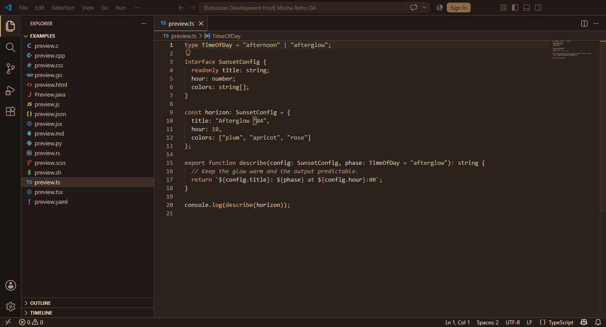
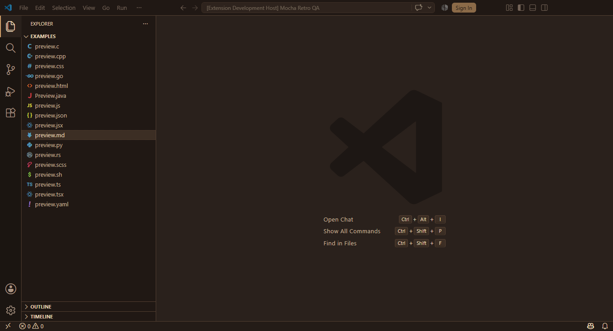
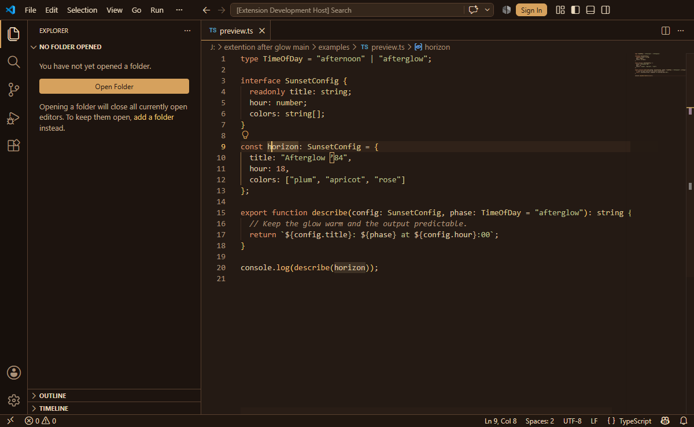
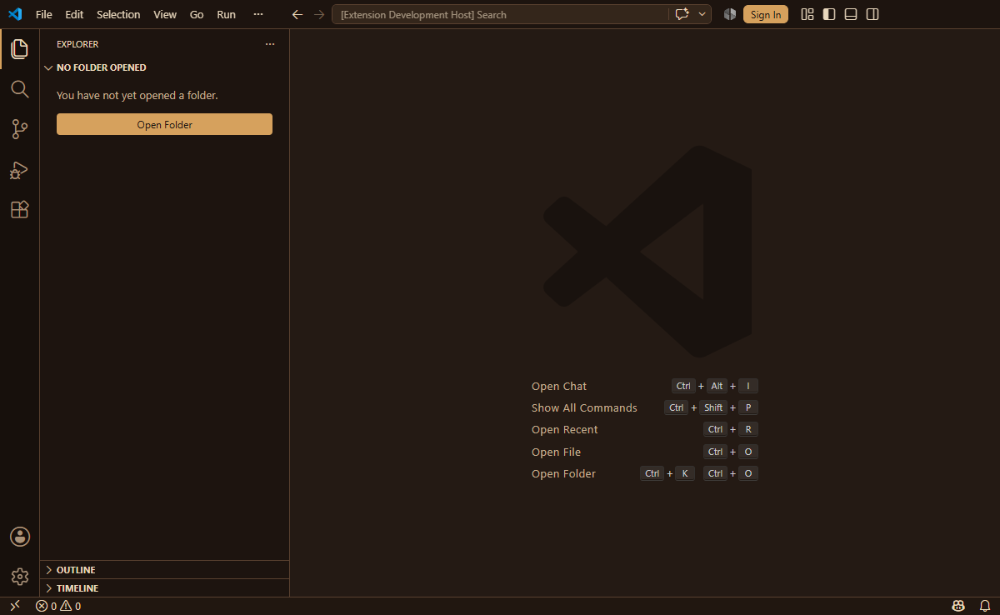

# Afterglow ’84

Afterglow ’84 is a warm, restrained dark theme for Visual Studio Code. It follows afternoon light into a plum evening with apricot functions, coral control flow, sage strings, and lavender types. Its visual language borrows from vintage computers, cassette packaging, and golden-hour skies without turning the editor into neon signage.

## Theme screenshots

These user-supplied screenshots show the four themes with no code file open. Icons and window layout reflect the user's setup and are separate from the color themes.

### Afterglow ’84


### Night Drive


### Golden Hour


### Retro Amber


## Design philosophy

- Keep large surfaces dark plum and reserve orange for focus, navigation, and small active states.
- Give syntax a stable hierarchy: coral control flow, gold callables, sage strings, pink numbers, lavender types, and warm neutral variables.
- Preserve the supplied palette instead of adding novelty colors. Semi-transparent overlays are palette colors with alpha.
- Favor comfortable long-session contrast over maximum saturation.

## Included themes

Afterglow ’84 now includes six coordinated color themes for different lighting conditions:

| Theme | Style | Best suited for |
| --- | --- | --- |
| **Afterglow ’84** | Balanced warm plum dark theme | Everyday coding and afternoon-to-evening use |
| **Afterglow ’84 — Night Drive** | Deeper, lower-brightness plum theme without a pure-black background | Late-night and dim-room coding |
| **Afterglow ’84 — Golden Hour** | Warm parchment light theme with darker sunset-inspired syntax colors | Bright rooms and daytime coding |
| **Afterglow ’84 — Retro Amber** | Near-black blue surfaces with amber focus, orange keywords, and lime strings | A restrained retro editor with warm accents |
| **Afterglow ’84 — Dark Roast** | Espresso and walnut surfaces, parchment text, caramel and copper accents | A vintage coffee-shop atmosphere with readable brown surfaces |
| **Afterglow ’84 — Mocha Retro** | Soft chocolate surfaces, warm cream, faded olive and golden caramel | A calm vintage café with lighter coffee-brown midtones |

### Mocha Retro palette and contrast

Install version **0.5.0**, run **Preferences: Color Theme**, and choose **Afterglow ’84 — Mocha Retro**. The shortcut is `Ctrl+K Ctrl+T` on Windows/Linux or `Cmd+K Cmd+T` on macOS. This dark variant brings together mocha coffee, walnut furniture, faded books and warm café lighting. It is lighter and softer than Dark Roast and keeps the empty editor brown as well.

| Role | Hex |
| --- | --- |
| Editor, gutter, empty editor, active tabs | `#2A211C` |
| Sidebar, title bar, inactive tabs | `#201814` |
| Activity bar | `#1B1511` |
| Panel, terminal, status bar | `#241C17` |
| Current line and subtle hover | `#33271F` |
| Inputs, menus, dropdowns and widgets | `#382B23` |
| Selected controls / inactive editor selection | `#58402E` / `#3C2E24` |
| Active editor selection, adjusted for contrast | `#412F22` |
| Borders and separators | `#544032` |
| Main text / secondary text / italic comments | `#E6D3B5` / `#C7B299` / `#AD9785` |
| Caramel focus / honey cursor | `#D3A16A` / `#EDC68C` |
| Copper keywords / golden functions and methods | `#D99A79` / `#DFB374` |
| Olive strings / sage regex | `#B5BE8A` / `#A9B59B` |
| Terracotta numbers and booleans / brass types and classes | `#D6A086` / `#D6C28E` |
| Parchment variables, parameters and properties / sand punctuation | `#DFCCB0` / `#C4AD91` |
| Errors and deletions / warnings / information | `#DF9285` / `#DFB374` / `#ADB7B0` |

Measured WCAG contrast is **10.77:1** for main text and **5.66:1** for comments against the editor. Comments and input placeholders on raised widgets measure **4.90:1**. Primary buttons use `#201814` text on caramel (**7.55:1**) and golden caramel on hover (**9.02:1**). Secondary buttons, selected lists, suggestions, inactive labels, input validation, notebooks, settings and other explicit text states are checked separately.

The active editor selection is the one necessary opaque adjustment to the supplied palette: `#58402E` becomes **`#412F22`**, the nearest passing shade along a proportional RGB darkening of that color. Graphical inspection confirmed that normal dark themes retain syntax colors when selected; [VS Code documents `editor.selectionForeground` for high contrast](https://code.visualstudio.com/api/references/theme-color#editor-colors). The proposed selection gave comments only **3.45:1**. The adjusted editor selection gives comments **4.56:1** and main text **8.67:1**, preserving the syntax hierarchy. Selected controls retain `#58402E` because their foregrounds can be specified independently. No comment color was lightened and no ordinary-text contrast exception was introduced.

Transparent overlays are composited before measurement. Search, word, bracket, peek and execution highlights use low-opacity palette tints. The matching-selection overlay uses alpha `5E` instead of `66`. Inserted and removed diff text use alpha `08` and `0B`, with line tints at `0A`, so comments still pass even when diff layers overlap the current-line background. The original stronger tints failed those checks. Caramel active indicators and brown separators stay restrained.

Disabled controls and decorative borders are treated separately. Disabled labels measure **2.72:1** on raised brown; separators measure **1.72:1** against the panel. The installed VS Code 1.136.1 generic button CSS uses 40% disabled opacity; compositing both button text and fill gives **2.35:1** over the editor and **2.40:1** over raised widgets. These disabled states are exempt from the ordinary-text threshold. There is no invented disabled-button theme key; VS Code controls that opacity.

All 16 terminal ANSI slots are explicit:

| ANSI family | Normal | Bright |
| --- | --- | --- |
| Black | `#1B1511` | `#AD9785` |
| Red | `#DF9285` | `#EDB0A6` |
| Green | `#B5BE8A` | `#CCD1A5` |
| Yellow | `#DFB374` | `#EDC68C` |
| Blue | `#9DAFBD` | `#B0C0C6` |
| Magenta | `#BD9FA7` | `#D0B0B6` |
| Cyan | `#9FBDB6` | `#B8CFC3` |
| White | `#E6D3B5` | `#EDDCC0` |

The muted blue, rose and cyan additions are limited to terminal ANSI roles. Every ANSI text slot except conventional background-like black passes 4.5:1 against the terminal. Shells and prompt frameworks can supply their own colors, so this theme cannot control every prompt element. It does not change icons, fonts, shell configuration, personal settings or panel layout.

Mocha Retro retains all documented language coverage, with italic comments, normal-weight source text and Markdown bold, italic and combined emphasis. Function calls and decorators use symbol-specific scopes; arguments, properties and readonly variables retain parchment. Built-in semantic functions and types keep their roles without a blanket `*.defaultLibrary` override. TextMate alone sees JavaScript `Math` and `Number` receivers as object variables; language-server tokens can refine their roles.

Real screenshots from the implemented theme in an isolated Windows Extension Development Host:





Validation for 0.5.0 covers 476 recognized workbench color IDs, 871 Mocha-specific state/overlay/palette checks, the existing family validators and four validator unit tests. Installed VS Code 1.136.1 grammars tokenize all 17 preview languages (1,378 token spans); 34 targeted assertions cover built-ins, calls, arguments, decorators, JSON/YAML keys and Markdown emphasis. Real TypeScript language-service tokens and rendered colors were inspected for functions, methods, parameters, types, readonly properties and built-ins.

The Windows graphical pass covered the empty editor, TypeScript, Markdown, Command Palette, context menu, hover documentation, suggestions, active/inactive selections, terminal ANSI output, synthetic error/warning/information diagnostics and side-by-side diffs. Comparisons used the original theme and Dark Roast in the same host. The native Windows automation helper was unavailable; VS Code's development-test API and Chromium renderer captures supplied the actual inspection and screenshots. Temporary profiles and fixtures are excluded from the VSIX.

Remaining manual checks: real Linux and macOS (Intel and Apple Silicon), VS Code's oldest supported version, native platform menus, every language server, notebook/settings interactions, live debugging, Git decoration states, and pointer-hover/disabled-button appearance. Those states have explicit colors and automated checks where applicable, but are not claimed as fully tested graphically.

### Dark Roast palette and contrast

Select **Afterglow ’84 — Dark Roast** using **Preferences: Color Theme** (`Ctrl+K Ctrl+T` on Windows/Linux, `Cmd+K Cmd+T` on macOS). This separate dark variant evokes wooden radios, tobacco leather, and incandescent lighting.

| Role | Hex |
| --- | --- |
| Editor, gutter, empty editor | `#241A14` |
| Sidebar, title bar, inactive tabs | `#1D140F` |
| Activity bar | `#17100C` |
| Panel, terminal, status bar | `#211710` |
| Current line and subtle hover | `#302219` |
| Inputs, menus, dropdowns, raised widgets | `#34261B` |
| Active / inactive selection | `#503826` / `#3B2A1F` |
| Borders and separators | `#59402F` |
| Main text / secondary labels / italic comments | `#E9D8BD` / `#C5AF93` / `#AA9279` |
| Focus and active-tab underline | `#D6A15D` |
| Cursor and active line number | `#F0C674` |
| Keywords / functions | `#D9956C` / `#E6B673` |
| Strings / regex bodies | `#B8BF8A` / `#A7BAA0` |
| Numbers and booleans / types | `#D7A184` / `#D8C18E` |
| Variables, parameters, properties / punctuation | `#DEC7A6` / `#CDB99B` |
| Errors and deletions / warnings / information | `#E39B91` / `#E6B673` / `#B3BDC2` |

Measured WCAG contrast against the editor is **12.18:1** for main text, **5.76:1** for comments, and **8.05:1** for secondary labels. Comments and placeholders on raised widgets measure **4.93:1**. Primary buttons use dark `#1D140F` text on caramel (**7.86:1**), with existing palette color `#E6B673` on hover (**9.75:1**). Selected editor text explicitly becomes parchment (**7.76:1**); keeping comment color on the active selection would measure only **3.67:1**. No base palette color was changed and no Retro Amber contrast exception applies.

Interaction shades reuse the palette. Alpha variants are limited to overlays, guides, minimap/scrollbar indicators, shadows, and disabled labels; contrast checks composite overlays first. Disabled labels measure **2.71:1** on raised brown and are exempt from the ordinary-text threshold. VS Code controls disabled button opacity; it has no dedicated supported disabled-button color key. The thin active-tab underline uses caramel; large debug and empty-editor surfaces stay brown.

Search, word, and bracket-match tints use alpha `10`; diff text and line tints use `14` and `0A`. These reduced opacities keep comments above 4.5:1, including current-line highlights and stacked diff tints. Stronger inherited accent overlays had measured as low as 3.14:1 for comments. Search borders and Git gutter marks retain clear accent colors.

All 16 ANSI slots are specified. Terminal-only additions preserve distinct muted blue (`#9DAFBD`), rose-magenta (`#BD9FA7`, bright `#D0B0B6`), and cyan (`#9FBDB6`, bright `#B8CFC3`) families; bright red `#EDB0A6`, green `#CCD1A5`, and white `#F3E6D2` distinguish bright slots. Other slots reuse the palette. ANSI black is a conventional background-like color, not an ordinary-text contrast claim.

Dark Roast retains the language coverage below with regular base text, italic comments, and meaningful Markdown emphasis. Broad `meta.function-call`, `meta.parameter`, and `*.defaultLibrary` overrides are omitted. Readonly variables remain parchment; identified functions and types retain their semantic roles.

Real screenshots captured from an isolated Windows Extension Development Host:





Validation for 0.4.0: the family validator passes 4,674 checks, with Retro Amber's pre-existing exceptions confined to that variant. Dark Roast's additional state/overlay contrast guards pass, as do the four validator unit tests. The installed workbench recognizes all 330 Dark Roast color IDs, and its JavaScript grammar verifies representative token colors. Windows Development Host inspection covered the empty editor, TypeScript/JavaScript/Python, semantic functions/parameters/interfaces/readonly variables/object keys, selections, suggestions, terminal ANSI output, and a TypeScript error in the Problems panel. The Python decorator inspection exposed a precedence mismatch; its TextMate rule was narrowed to agree with the copper semantic decorator rule.

Still required for a broader visual sign-off: Git diffs, menu interactions, warning/information states, disabled buttons, every language grammar, and real Linux/macOS checks. The VSIX was packaged and inspected, but installation into a normal Windows profile was not performed. Temporary inspection profiles are excluded from Git and the VSIX. Screenshot links remain relative so the source README can display the bundled images without publishing or inventing remote image URLs.

The original three variants preserve the same syntax hierarchy while adjusting brightness and contrast for their backgrounds. Retro Amber uses its own syntax assignments, including lavender parameters and neutral variables and object properties.

### Retro Amber palette and contrast

| Role | Hex |
| --- | --- |
| Editor, sidebar, activity bar, panel | `#0D1017` |
| Default text, variables, object properties | `#BFBDB6` |
| Current line | `#161A24` |
| Selected Explorer row / subtle separators | `#181D26` |
| Active tab underline / focused input outline | `#E6B450` |
| Keywords / control flow | `#FF8F40` |
| Functions / methods | `#FFB454` |
| Strings | `#AAD94C` |
| Parameters / numbers / booleans | `#D2A6FF` |
| Regular-expression body | `#95E6CB` |
| Italic comments | `#5A6673` |
| Muted interface labels | `#5A6378` |

Against `#0D1017`, default text measures **10.12:1**, comments **3.25:1**, and muted labels **3.16:1**. Comments and muted labels intentionally fall below the earlier 4.5:1 target to retain the supplied reference colors. Validation prints these as **EXCEPTION**, never as passing 4.5:1 results. Muted labels on raised surfaces can have still lower contrast. The original three themes retain their existing contrast requirements; this is not a claim that every interface state is accessible.

Unshown states are design choices: coral `#F07178` errors, amber/orange warnings, lavender information, dark hover widgets, blue-gray `#273140` selections, and translucent lime/coral diffs. Terminal ANSI colors reuse the syntax palette with lighter bright shades; ANSI black remains a background-like color. These values are not claimed as exact screenshot matches.

The new palette follows the supplied sampled colors; the reference image was unavailable during implementation. A color theme cannot reproduce Explorer icons, PowerShell prompts, font rendering, or panel positions. No icon selection, font, prompt, layout, or bracket-colorization setting is changed. Supported bracket colors retain normal VS Code behavior.

Theme files are hand-authored; there is no theme generator. Workbench colors and semantic selectors follow the official [color-theme system](https://code.visualstudio.com/api/extension-guides/color-theme), [color reference](https://code.visualstudio.com/api/references/theme-color), and [semantic highlighting guide](https://code.visualstudio.com/api/language-extensions/semantic-highlight-guide).

## Palette

The following palette defines the original **Afterglow ’84** dark variant:

| Role | Hex |
| --- | --- |
| Editor background | `#211A24` |
| Editor foreground | `#F3DDC4` |
| Sidebar background | `#1A151D` |
| Activity bar background | `#171219` |
| Panel background | `#1D171F` |
| Input background | `#2A202D` |
| Current line | `#2B222F` |
| Selection | `#594052` |
| UI border | `#4A3947` |
| Cursor | `#FFB35C` |
| Primary accent | `#FF9A62` |
| Error | `#FF5F68` |
| Warning / functions | `#FFC56E` |
| Information / types | `#D6A7FF` |
| Success / strings | `#A8D89B` |
| Comments | `#A08799` |
| Keywords | `#FF7A70` |
| Numbers | `#E89AC7` |
| Variables | `#F0C9A5` |
| Operators | `#CAB6A4` |

Derived opaque shades are limited to `#120E14` (shadow), `#30253B` (information validation), `#3B2229` (error validation), `#3B3024` (warning validation), `#3A2B3A` and `#6A4B61` (interaction states), `#7B4653` (debug status), `#AD553E` and `#B05740` (accessible button states), and `#FFF4E5` (high-contrast text on selected controls). They were selected as close plum/orange/cream relatives for small UI states; translucent values append an alpha channel to palette colors. Button text measures `4.66:1` normally and `4.51:1` on hover.

## Language coverage

TextMate rules and semantic tokens cover common constructs in JavaScript, TypeScript, React/JSX/TSX, Python, C, C++, HTML, CSS, SCSS, JSON, YAML, Markdown, shell scripts, Java, Rust, and Go. Highlighting ultimately depends on the active language grammar and language server, so extensions may expose additional scopes or semantic tokens.

## Platform support

Afterglow ’84 is a declarative color-theme extension with no native binaries or runtime platform code. It is designed to work with supported versions of Visual Studio Code on:

- Windows 10 and Windows 11
- macOS on Intel MacBooks
- macOS on Apple Silicon MacBooks
- Linux

Useful shortcuts:

| Action | Windows / Linux | macOS |
| --- | --- | --- |
| Open Command Palette | `Ctrl+Shift+P` | `Cmd+Shift+P` |
| Open Extensions | `Ctrl+Shift+X` | `Cmd+Shift+X` |
| Start Extension Development Host | `F5` | `F5` or `fn+F5` |

On macOS, if the `code` command is unavailable, open the Command Palette and run **Shell Command: Install 'code' command in PATH**, then restart the terminal.

## File icons

This extension provides color themes only. It does not include or activate a file-icon theme or product-icon theme, and it does not change your existing icon settings. You can continue using any file-icon theme you prefer.

The image in `assets/icon.png` is only the extension’s Marketplace logo; it does not replace icons in the VS Code Explorer.

## Install locally

To test the source folder directly:

1. Open this folder in VS Code.
2. Press `F5` and select **Run Afterglow ’84 Theme** if prompted. On a MacBook, use `fn+F5` if the function keys control hardware features.
3. In the Extension Development Host, run **Preferences: Color Theme** and choose **Afterglow ’84**, **Afterglow ’84 — Night Drive**, **Afterglow ’84 — Golden Hour**, **Afterglow ’84 — Retro Amber**, **Afterglow ’84 — Dark Roast**, or **Afterglow ’84 — Mocha Retro**.
4. Open files under `examples/` to inspect representative syntax.

## Build and install a VSIX

Install dependencies and validate:

```sh
npm install
npm run validate
npm run package
```

Run validator unit checks with `node --test scripts/validate-family.test.mjs`. Optionally run `node scripts/validate-vscode.mjs "<VS Code resources/app directory>"` to check color IDs against an installed workbench, retain the existing JavaScript checks and test all Mocha Retro preview grammars and precedence cases. This requires a desktop VS Code installation containing `node_modules.asar`; it does not replace a graphical or language-server test.

The manifest uses the Marketplace publisher ID `Retrocoder`. Confirm that this exact identifier belongs to your **Retro Coder** publisher account before publishing.

Install the generated archive with **Extensions: Install from VSIX...**, or run:

```sh
code --install-extension afterglow-84-0.5.0.vsix
```

The same `.vsix` works across Windows, macOS, and Linux because the extension contains no platform-specific runtime code. Packaging does not publish the extension.

## Inspect token scopes

In the Extension Development Host, place the cursor on a token and run **Developer: Inspect Editor Tokens and Scopes**. The inspector shows the TextMate scope stack, semantic token, and winning theme rule. Use the preview files to check comments, control flow, callables, types, variables, constants, tags, attributes, and invalid syntax across grammars.

For Retro Amber, check `examples/preview.js`: `sunset` should be orange-gold, `hour`, `18`, and `true` lavender, `"Afterglow"` lime, and the regex body mint. Repeat with semantic highlighting enabled and disabled; variables and object keys should remain neutral. Check the thin amber underline below the active tab, focused input outline, Explorer selection, and bracket pairs. A graphical comparison and real macOS testing remain pending.

Without semantic highlighting, the built-in JavaScript grammar marks the `hour` declaration as a parameter but its later references as ordinary variables (neutral). The semantic `parameter` rule supplies lavender for identified references; a color theme alone cannot infer symbol identity from TextMate scopes.

## Known limitations

- Semantic highlighting varies with the installed language extension and language-server state.
- Third-party grammars can use scopes not covered by the built-in-language-oriented rules.
- UI appearance varies slightly across VS Code versions, operating systems, and custom title-bar settings.
- A visual pass in an Extension Development Host is still required after changes; automated contrast and schema checks cannot judge every interaction state.
- Platform-neutral validation does not replace a final visual check on real macOS hardware.

## Late-night recommendation

When working around midnight or 3 a.m., enable **Night Light** on Windows or supported Linux desktops, or **Night Shift** on macOS. The warmer display temperature blends naturally with the Afterglow ’84 palette and may feel more comfortable in a dark room.

## Contributing

Open the relevant preview file, reproduce the token or UI state, and use the token inspector before changing a rule. Keep changes within the established palette where possible. Run `npm run validate` and rebuild the VSIX before sharing changes. Please do not add runtime code, telemetry, network access, or unrelated theme variants.


Please do not commit to Main file directly open a new branch everytime to wish to contribute.


## License

Copyright (c) 2026 Abu Koushik. Released under the MIT License; see `LICENSE` in the extension root.

## Afterglow ’84 — Midnight Mocha (0.6.0)

Midnight Mocha adds a seventh selectable theme, based on Night Drive. Walnut dashboard browns, cream text, caramel focus indicators and restrained copper keywords evoke vintage radios and warm streetlights during a midnight drive. Large surfaces stay distinctly brown, with subtle separation between the editor, sidebar, activity bar and panels. Cool colors are reserved for small informational and terminal accents. All six previous theme files and selectable names are preserved.

Choose **Afterglow ’84 — Midnight Mocha** under **Preferences: Color Theme**. The variant has 498 explicit UI colors, including settings, menus, the command palette, suggestions, hover widgets, notifications, terminal, diff/merge views, debugging, minimap and breadcrumbs. It retains Night Drive's syntax categories and language coverage, italic comments and Markdown emphasis. TextMate and semantic tokens share the same role colors; narrowed expression scopes keep arguments and built-in functions from inheriting an enclosing expression's color. JSON/YAML keys and named callables have explicit rules.

| Role | Color |
| --- | --- |
| Editor background | `#1C1512` |
| Editor foreground / variables / parameters / properties | `#E8D5BF` |
| Sidebar background | `#17110F` |
| Activity bar background | `#120D0B` |
| Panel / terminal background | `#191210` |
| Inputs and popup backgrounds | `#271D18` |
| Current line | `#241B16` |
| List, menu and general UI selection | `#4A3529` |
| Editor selection, adjusted for comment contrast | `#36271F` |
| Borders | `#4B382D` |
| Focus accents and cursor | `#E8AC71` |
| Comments | `#A28F7D` |
| Keywords | `#D98B73` |
| Functions / warnings | `#E6B86A` |
| Strings | `#B2BD8A` |
| Types and classes | `#D5BB91` |
| Numbers / constants / readonly symbols / regex / decorators | `#D4A291` |
| Operators and punctuation | `#C7B39C` |
| Errors | `#EB8A80` |
| Information | `#9EBDD0` |

The supplied selection brown `#4A3529` gives the supplied comments only **3.69:1** contrast. Midnight Mocha darkens the editor selection to `#36271F`, giving selected comments **4.61:1**, while keeping the supplied syntax palette and using `#4A3529` for UI selections. This does not rely on `editor.selectionForeground`, which VS Code documents as a [high-contrast selection color](https://code.visualstudio.com/api/references/theme-color#editor-colors).

Measured text contrast is **12.61:1** in the editor, **5.80:1** for comments, and **5.30:1** for comments in popup surfaces. Primary buttons use dark brown text on caramel: **9.07:1** normally and **10.28:1** on hover. Additional interaction fills use `#30231C`, primary-button hover uses `#EDBA88`, and overlays use transparent palette colors. Search, bracket, debugging and stacked diff highlights are checked with their actual backgrounds. Decorative separators and VS Code's own disabled-control opacity are not treated as normal text.

All 16 terminal ANSI slots are explicit. Black remains a conventional dark terminal background; the other 15 slots, including bright black, meet 4.5:1 against the terminal background. Terminal applications and VS Code's terminal contrast setting can affect rendering.

| ANSI slot | Normal | Bright |
| --- | --- | --- |
| Black | `#120D0B` | `#A28F7D` |
| Red | `#EB8A80` | `#F0AAA0` |
| Green | `#B2BD8A` | `#CAD1A4` |
| Yellow | `#E6B86A` | `#F0CC8C` |
| Blue | `#9EBDD0` | `#B6CEDC` |
| Magenta | `#C39AA4` | `#D8B4BA` |
| Cyan | `#A3BDB2` | `#BDD0C5` |
| White | `#E8D5BF` | `#F3E2CE` |

Build the local 0.6.0 package using the existing workflow:

```sh
npm run validate
node --test scripts/validate-family.test.mjs
npm run package
code --install-extension afterglow-84-0.6.0.vsix
```

`npm run validate` includes the Midnight Mocha contrast, overlay, palette and inherited-coverage checks. The optional `node scripts/validate-vscode.mjs "<VS Code resources/app directory>"` check now includes all 17 Midnight Mocha preview grammars and 34 targeted precedence checks. For full schema validation, launch an isolated Extension Development Host with `--extensionDevelopmentPath=<absolute project directory>` and `--extensionTestsPath=<absolute project directory>/scripts/validate-vscode-schema.cjs`. The test uses the installed JSON language service's actual color-theme schema, validates Git decoration IDs against the bundled Git declarations, and confirms that invalid colors, styles and IDs are rejected. It does not change workspace trust.

Windows VS Code 1.136.1 previews were inspected for TypeScript, Python, HTML, selected comments, the command palette, settings and buttons, synthetic diagnostics and their hover, and side-by-side diffs. The preview ran in Restricted Mode: populated language-server completions, live semantic-token output, terminal ANSI rendering, real debug sessions and a full interaction pass remain unverified. Real macOS Intel, macOS Apple Silicon and Linux testing also remains pending. The extension stays declarative and platform-neutral, with no runtime entry point, native code, telemetry, icon-theme contributions or font requirements. Developer validation scripts and local QA fixtures are excluded from the VSIX.

## GitHub Actions CI and releases

`.github/workflows/ci-release.yml` runs on pull requests targeting `main`, pushes to `main`, and `v*` tag pushes. Linux, Windows and macOS runners install the exact lockfile with `npm ci`, run all theme validators and Node tests, then package and inspect the VSIX. Every platform must pass before a release build or publication can run. These checks verify packaging and source portability; they do not replace the desktop previews or real hardware checks described above. Installed-editor schema/grammar checks remain optional local checks because they require a separately installed VS Code.

Run the same portable checks locally:

```sh
npm ci
npm run validate
npm test
npm run package:check
```

`package:check` invokes the existing `vsce package` command in a newly created, empty `.release/build-*` directory and prints the exact VSIX path and SHA-256. It compares the archive's manifest, documentation, images and every registered theme against the source, including Midnight Mocha, and rejects missing themes or unexpected packaged files. `.release/` and all `.vsix` files are ignored by Git; workflows, QA files, build output and developer scripts are excluded from the extension. The lockfile pins packaging dependencies, and `SOURCE_DATE_EPOCH` uses the source commit's timestamp for repeatable archives. Release builds use the pinned Node version on Linux.

To publish a new version:

1. Work on a contribution branch, update `package.json`, the lockfile, theme/source changes and the matching changelog section, then run the checks above. Commit the source and workflow, without adding generated VSIX files.
2. Open a pull request to `main`, let all three platform checks pass, and merge it. The workflow and the intended theme source must exist in the commit being released. An uncommitted local theme cannot be built by a GitHub-hosted runner. If a future repository instruction requires keeping source uncommitted, stop and report that conflict; never tag an older commit as a substitute.
3. Fetch the merged source, check that the working tree is clean, and create a new stable version tag matching both manifest and lockfile. For version 0.6.0:

   ```sh
   git switch main
   git pull --ff-only origin main
   git status --short
   git tag -a v0.6.0 -m "Afterglow 84 0.6.0"
   git push origin v0.6.0
   ```

4. Watch **CI and VSIX release** in GitHub Actions. The tag run repeats all three platform checks, builds from the exact tagged commit, and passes only that newly generated VSIX to the release job. Invalid tags, version mismatches, dirty source, missing themes and failed checks block publication.

The only publishing destination is this repository's [GitHub Releases](https://github.com/koushik-stack/After-Glow-84-VSCODE-Extension-Package-/releases). Validation and build jobs have `contents: read`; only the release job receives `contents: write`, using the built-in `GITHUB_TOKEN`. No Marketplace, Open VSX, npm or GitHub Packages publishing token or command is used. Dependencies are not installed in the job that holds write permission.

Each release has **exactly one uploaded asset**, `afterglow-84-<version>.vsix`. Its SHA-256 and source commit appear directly in the release notes. The workflow never uploads release ZIPs, source bundles, logs, screenshots or separate checksum files. GitHub itself [automatically provides source ZIP/tarball download links](https://docs.github.com/en/repositories/releasing-projects-on-github/about-releases); those are separate from the single uploaded release asset. The internal Actions artifact transfers only the VSIX between jobs and expires after seven days.

Rerunning a successful tag workflow verifies the existing release's filename, size, SHA-256, source commit and single-asset inventory, then succeeds without changing it. An interrupted matching draft can resume. A different checksum, extra asset, missing published asset, unrelated release metadata or moved tag causes a failure requiring manual review; the pipeline never deletes or overwrites an asset and never creates or moves a tag. If the internal build artifact has expired, rerun all jobs to rebuild it. Use a new version tag for changed source, and never force-push an existing release tag.
